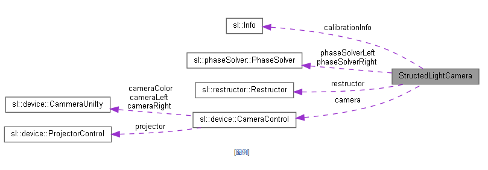

# **LibStructedCamera**
***
StructedCamera SDK to easy use.Mutiply solve phase algorithm and accelerate method can be used,  
ofcause you can choose only cpu can be used if you don't have a NVIDIA GPU.  
# Related Works
***
Please cite this work if you make use of this system in any of your own endeavors:  
> **@File：libStructedCamera**  
> **@Authour: Liu Yunhuang**  
> **@Email: 1369215984@qq.com**  
> **@Data: 2022.5.16**  
# 1. What do I need to build it?  
## 1.1 Windows  
***
- CMake  
- AVX  
- Eigen  
- OpenCV  
- CUDA(optional)  
Firstly,please make sure your cpu is supported by AVX.  
Then install cmake,Eigen and OpenCV(built with Eigen、CUDA).  
If you want to a higher performance, make sure your computer have a NVIDIA GPU and install CUDA.  
Finally,cmake, built and install it.  
## 1.2 Ubuntu  
**as same as windows install step,but you shoud install usbseral SDK and huaray SDK which based on the Linux system.  
because of that our code is only provid Windows lib kit.**  
# 2. How do I use it?  
***
You can find a StructedlightCameraConfig.cmake file in your install path.  
So you only to add your install path to your system path.  
Then,your CMakeLists.txt can add these:  
> find_package(StructedLightCamera REQUIRED)  
> include_directory(${StructedLightCamera_INCLUDE_DIRS})  
> target_link_libraries(${StructedLightCamera_LIBRARIES})  
**Please be aware of that you should add CUDA defination to use CUDA.Like this:**  
> find_package(CUDA REQUIRED)  
> if(CUDA_FOUND)  
> add_defination(-DCUDA)  
> endif()

The system is contrusted like this:  

**You can be aware of that our phasesolve and restructor is a Factory mode,so you can get what you want though Polymorphism.**  
***  
**You can see `structedLightCamera.h` to learn how to use it.**  
**A document in our `doc` folder is used to explain this project.**

